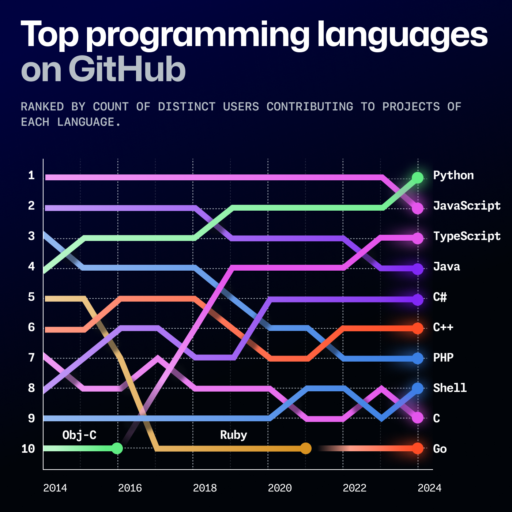
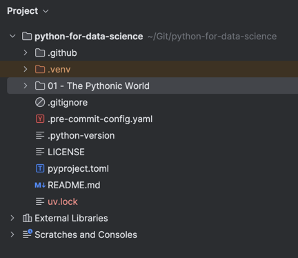
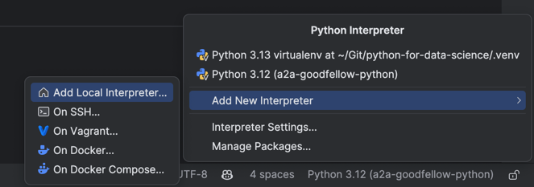
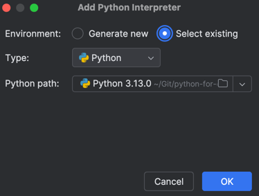
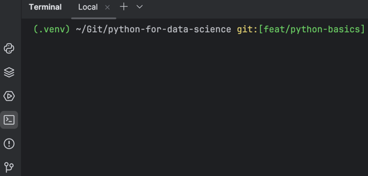
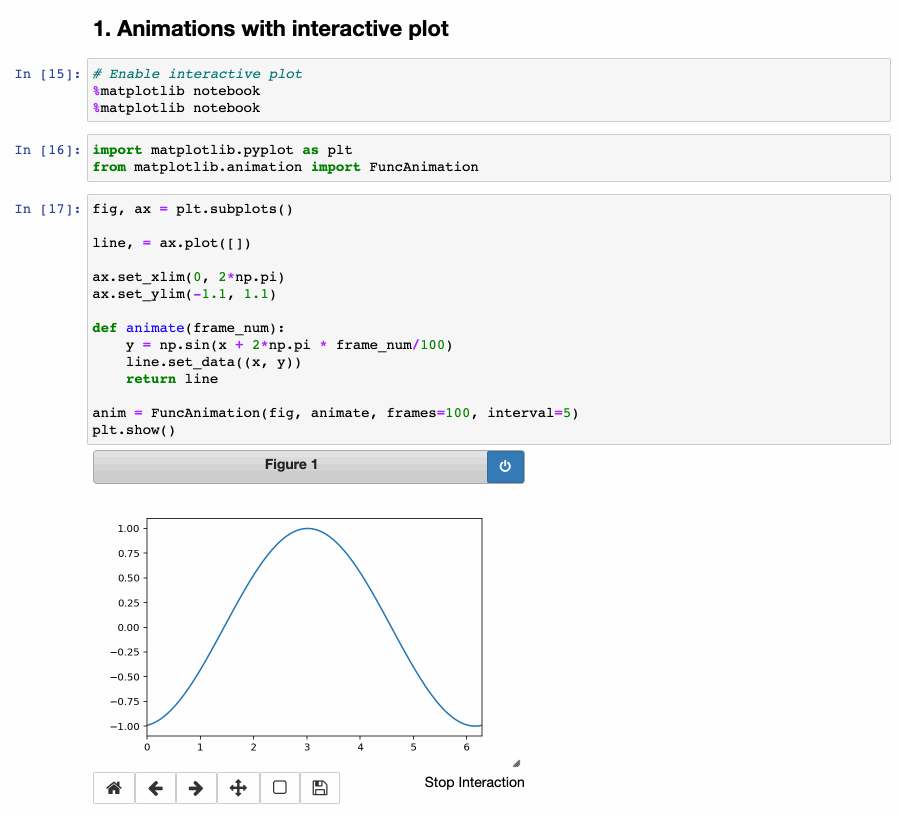

# The Pythonic World

## Why are you here?

Python has become a cornerstone language for data science due to its unparalleled popularity and versatility. 

According to the [2024 Octoverse report by GitHub](https://github.blog/news-insights/octoverse/octoverse-2024/), Python ranks as one of the most widely used programming languages globally, supported by a vast and active developer community. 
Similarly, the [Stack Overflow Developer Survey 2024](https://survey.stackoverflow.co/2024/technology#most-popular-technologies-language) highlights Python as a top choice among developers, particularly for data-related tasks. 

Its simplicity and readability make it accessible to professionals with varying levels of programming experience, while its extensive ecosystem of libraries (such as NumPy, pandas, polars, plotly, scikit-learn, and streamlit) provides powerful tools for everything from data manipulation to machine learning. 
Python’s open-source nature and compatibility with other technologies further solidify its status as an essential skill for data science professionals.



## How to Develop in Python
[PyCharm](jetbrains.com/pycharm/download) and [VS Code](https://code.visualstudio.com/) are the best Python Integrated Development Environments (IDEs).
VS Code is free and open-source, while PyCharm has a free community edition.
In this class, we will use PyCharm.

### Notebooks
Jupyter Notebooks are a great way to write and run Python code. 
They are widely used in data science and machine learning as a form of literate programming, that is the union of code, text, and charts.
You can run Jupyter Notebooks in your browser, and they are great for prototyping and sharing code.

## How to Get Python
You can download python directly on your machine from the [Python website](https://www.python.org/downloads/).
But you should not. If you do that, you will only be able to use one version of the language.
As a new major release happens every year - usually in October, your machine will soon be outdated.
The best way forward is to use **virtual environments**.

## Virtual Environments
In Python, a **virtual environment** is an isolated workspace that allows you to manage project-specific dependencies without affecting other projects or the system-wide Python installation. 

This isolation ensures that each project has its own set of libraries and versions, preventing conflicts and enhancing reproducibility.

Traditionally, Python's built-in `venv` module is used to create virtual environments. 
However, tools like [Astral's `uv`](https://docs.astral.sh/uv/) offer enhanced functionality and performance. 
`uv` is an extremely fast Python package and project manager written in Rust, designed to replace tools like `pip`, `pip-tools`, and `virtualenv` with a unified interface. 

### Why Use `uv` for Virtual Environments?

- **Performance**: `uv` is significantly faster than traditional tools, providing a more efficient workflow. 
- **Unified Toolchain**: It combines multiple functionalities, reducing the need for separate tools.
- **Enhanced Dependency Management**: Offers advanced features like dependency version overrides and reproducible resolutions. 

## Getting Started with Python
> [!NOTE]
> We'll write this tutorial assuming you're running a Windows machine, but the steps are similar for Mac and Linux.

1. Install `uv` from Astral: it is an open-source Python package and project manager. We'll use it to install different versions of Python and manage our project dependencies.
    ```shell
    powershell -ExecutionPolicy ByPass -c "irm https://astral.sh/uv/install.ps1 | iex"
    ```
    You may want to add the autocompletion feature to your shell. To do so, check the official documentation [here](https://docs.astral.sh/uv/getting-started/installation/).

  To check whether `uv` was installed correctly, run:
  ```shell
  uv --version
  ```

2. Install Python 3.13 using `uv`:
   ```shell
   uv python install 3.13
   ```
   Try running `uv run python --version` to check if the installation was successful.

In case you get an error, you may need to restart PyCharm or even your laptop. This is necessary to have the environment variables set correctly.

You may also want to try running some statement in the Python REPL to check if everything is working as expected.
Start the Python REPL by running:

```shell
uv run python
```

Then, type `print("Hello, World!")` and press Enter. You should see the output `Hello, World!`.

> [!NOTE]
> In a Windows system, just typing `python` will default to the system app alias, and will not use the `uv`-managed Python installations.

## Setting up a Project

Before setting up the project, you may want to check out uv's features on the [official documentation](https://docs.astral.sh/uv/getting-started/features/).

Then create a new directory for your project and navigate to it. Then run:

```shell
uv init
```

You will see three new files in your project directory:

- `pyproject.toml`: a file that contains the project's metadata and dependencies.
- `hello.py`: a Python script that will be the entry point of your project.
- `.python-version`: a file that contains the Python version used in the project.

Open the `pyproject.toml` file and check the content. You will find the full specification of the file [in the Python packaging guide](https://packaging.python.org/en/latest/guides/writing-pyproject-toml/). 
But that's not important for now. You can leave the file as it is.

## Creating a Virtual Environment
To create a virtual environment, run the following command:

```shell
uv venv
```
This command will create a new directory called `.venv` in your project directory.
This directory will contain the Python installation and the packages you install in your project.

## Using the Virtual Environment
Before using the virtual environment, you need to activate it. Otherwise, you will be using the global environment:
- On macOS/Linux: `source .venv/bin/activate`
- On Windows: `.venv\Scripts\activate`

Then you can install packages by running `uv add <package>` and remove them by running `uv remove <package>`.
When you clone a project, you can install all requirements by running `uv sync`.
In the project directory, you can run a python script by running `uv run <module.py>`.
Find out more on the [official uv documentation](https://docs.astral.sh/uv/guides/projects/).

To exit the environment, you can run `deactivate` or simply close and reopen the terminal.

## Best Practices with Virtual Environments

1. **Consistent Usage**: Always use `uv` for managing environments and dependencies to maintain consistency.
2. **Version Control**: Add the `.venv` directory to `.gitignore` to avoid committing environment files.
3. **Documentation**: Keep your `pyproject.toml` and `uv.lock` updated to reflect the current state of your environment. If you consistently use `uv`, it will do the job for you.

## Using PyCharm
If you use PyCharm, once you create the virtual environment, you should see something like this:


To select the virtual environment, and allow PyCharm to work properly, go to the bottom right and follow these steps:



Choose the `python` executable in the `.venv/bin` directory and then click OK.
When you open the terminal in PyCharm, you should see the virtual environment activated:


## Running Jupiter Lab
To install and run Jupyter Lab in a virtual environment, you can use the following command:
```shell
uv add jupyterlab
jupyter lab
```
A browser window will open with Jupyter Lab running. 
You can create a new notebook by clicking on the `+` sign on the left sidebar.

