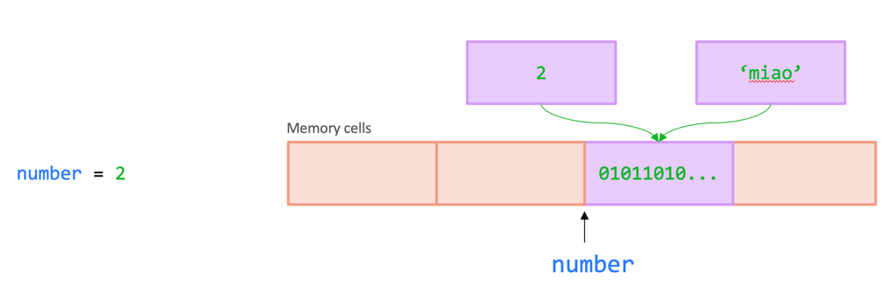
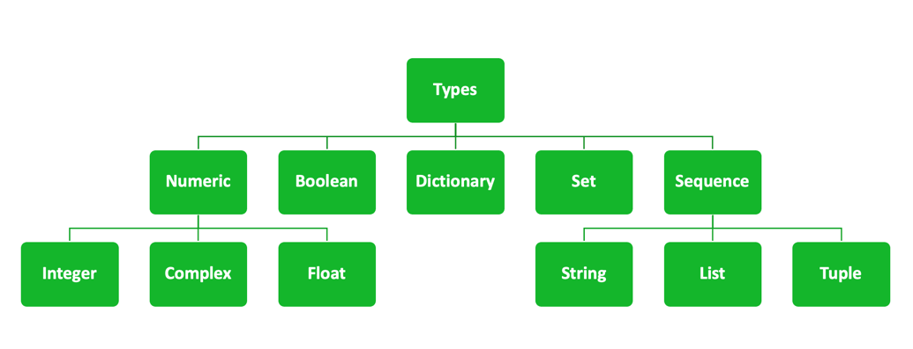
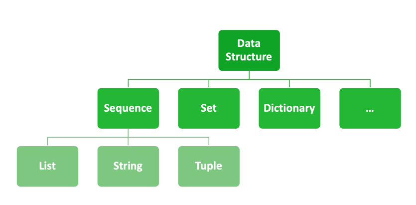

# The Pythonic Way

## What is Python?

Python is an interpreted, high-level, general-purpose programming language. 

Created by Guido van Rossum and first released in 1991, Python's design philosophy emphasizes code readability with its notable use of significant whitespace. 

Its language constructs and object-oriented approach aim to help programmers write clear, logical code for small and large-scale projects. 

Python is dynamically typed and garbage-collected. 

It supports multiple programming paradigms, including procedural, object-oriented, and functional programming. 

Python is often described as a "batteries included" language due to its comprehensive standard library.

## Use Python for...
- backend of web applications
- automating boring stuff
- data processing
- linear algebra
- statistics
- machine learning
- data visualization
- dashboards

## Do NOT Use Python for
- frontend of general-purpose web apps
- applications where performance is critical

## 1. Variables and Assignments
You may well use Python as a calculator:
```python
2 + 2 # prints 4
```
But this is not very useful. To create more complex programs, you need to store values in variables.
A variable is a storage location (identified by a memory address) paired with an associated symbolic name (an identifier), which contains some data referred to as a value.



However, if everything in memory is represented as bits, how can Python know what a variable is?

The answer is in types. Each variable is associated to a type, which tells Python how to interpret the bits in memory. For example, an integer is represented as a sequence of bits, and Python knows how to interpret them as a number. As we shall see, Python has many different types.



Python is dynamically typed, so you don't need to declare the type of a variable explicitly.

```python
x = 10           # Integer assignment
y = 3.14         # Float assignment
name = "Python"  # String assignment
```

> [!NOTE]
> Note the lines starting with `#` are comments. They are ignored by the Python interpreter and are used to add notes or explanations to your code.

Variables can be **reassigned** to different values and even different types. Unlike other programming languages, Python does not require you to declare the type of a variable explicitly.

```python
x = "Now I'm a string"
```

> [!TIP]
> [Python Variables and Assignment](https://www.programiz.com/python-programming/variables-constants-literals)

## 2. Simple Types: `int`, `float`, `str`

Python has several built-in data types for handling various kinds of data. Here are the most basic ones:

- **Integer (`int`)**: Whole numbers, e.g., `42`.
- **Float (`float`)**: Numbers with a decimal point, e.g., `3.14`.
- **String (`str`)**: Sequence of characters, e.g., `"hello world"`.

Example:

```python
age = 25           # int
price = 19.99      # float
message = "Hello"  # str
```
There are also other types, for example complex numbers, which are rarely used. Another type worth mentioning is `bool`, which represents a logical value (`True` or `False`). `None` is also another special object, though it's not a boolean. We'll talk about them soon.


### String formatting
A very common operation with strings is to concatenate them. 
This is done with the `+` operator:

```python
first_name = "Alice"
last_name = "Smith"
full_name = first_name + " " + last_name
print(full_name)  # Output: Alice Smith
```

However, a more Pythonic way to format strings is to use the `f-string` syntax:

```python
full_name = f"{first_name} {last_name}"
print(full_name)  # Output: Alice Smith
``` 

f-strings are useful in creating long strings from other variables.
Find out more at the [Python string formatting tutorial](https://docs.python.org/3/tutorial/inputoutput.html#fancier-output-formatting).

## 3. Python as a calculator

Let's focus on numerical objects, for now.

Objects are of no use unless you can do something with them. `functions` are what we use to transform, manipulate, and work with objects.

Our first use for objects is to build a simple calculator. Just as with mathematical notation, we can use some mathematical symbols and characters to perform calculations:

- `+` for addition
- `-` for subtraction
- `*` for multiplication
- `/` for division (returns a float)
- `//` for floor division (returns an integer, discards the decimal)
- `%` for modulus (returns the remainder)
- `**` for exponentiation

Examples:

```python
a = 10
b = 3

sum_result = a + b      # Addition, returns 13
difference = a - b      # Subtraction, returns 7
product = a * b         # Multiplication, returns 30
quotient = a / b        # Division, returns 3.333...
floor_division = a // b # Floor division, returns 3
remainder = a % b       # Modulus, returns 1
power = a ** b          # Exponentiation, returns 1000
```

> [!TIP]
> [Python as a calculator](https://docs.python.org/3/tutorial/introduction.html#using-python-as-a-calculator)

## 4. Operators in Python

The mathy syntax we used above is an example of one class of operators in Python: arithmetic operators. There are a couple more, but we'll focus on the most common ones: comparison operators and logical operators. They are incredibly useful when it comes to building conditional statements and loops.

### Comparison operators

Python supports comparison operators: `>` (greater than), `<` (less than), `==` (equal to), `!=` (not equal to), `>=` (greater than or equal to), `<=` (less than or equal to).

```python
a = 10
b = 5

greater_than = a > b  # True
less_than = a < b     # False
equal_to = a == b     # False
not_equal_to = a != b # True
```

### Logical operators

Logical operators are used to combine multiple conditions into a single boolean value. They are represented by the keywords `and`, `or`, and `not`. For example:

```python
age = 17

can_drive = age >= 18     # False

is_student = age <= 25  # True

can_drive and is_student  # False
```

Though technically not logical operators, there are also `is` and `in`. The `is` operator checks if two variables refer to the same object in memory. The `in` operator checks if a value is present in a sequence (such as a list or a string).

> [!TIP]
> [Python Operators](https://www.programiz.com/python-programming/operators)
> [Python Booleans: Use Truth Values in Your Code](https://realpython.com/python-boolean/)
> [Python '!=' Is Not 'is not': Comparing Objects in Python](https://realpython.com/python-is-identity-vs-equality/)

## 5. Functions

Python isn't just a calculator, and operators aren't the only way to manipulate objects. In fact, just like any other programming language, Python borrows the concept of functions from mathematics to define operations that take in any number of inputs and return any number of outputs.

Some functions are built-in: all of the operators we saw above are functions. But here is another, useful one:

```python
print(age)
print(can_drive and is_student)
```

The `print` function is a built-in function that prints the value of an object to the console (i.e., the screen, for the person to see).

Another useful built-in function is `type`, which returns the type of an object. For example:

```python
type(age)  # <class 'int'>
type(can_drive)  # <class 'bool'>
```

> [!TIP]
> Note the special syntax `<class 'int'>` and `<class 'bool'>`? This is Python telling us that objects in Python belong to a certain `Class`. We won't cover classes in this course, but you can read more about them [in the official documentation](https://docs.python.org/3/tutorial/classes.html). Classes are a powerful concept that brings about data and behaviour, and even if we don't know how to build one, we will use a lot of them everywhere, even when we don't realise it: everything in Python is a class - even functions!

## 6. Methods

As we said above, in Python everything is an object and every object has its own type. This means that different objects can do different things - but how do we do them? Enter *methods*, i.e. a way to call a function that is defined for an object of a specific type and works on the object itself. Let's forget about numbers for a second, and go back to strings:

```python
message = "Hello"
```

We can perform operations on strings, such as concatenation:

```python
name = "Luca"

print("Hello" + name + "!")
```

Or check its length:

```python
len(name)
```

This behaves differently than the `+` operator, when used with numbers. However, strings can do a lot more! For example, we can use the `[]` symbols to access individual characters:

```python
name[0]  # will return "L"
name[1]  # will return "u"
name[2]  # will return "c"
```

This notation is called *indexing*, and it allows us to access elements of a sequence. We can also access to ranges of elements:

```python
name[0:3]  # will return "Luc"
name[1:4]  # will return "uca"
```

> [!TIP]
> Indexing in Python is zero-based, so the first element is at index 0, the second at index 1, and so on.

We can also use negative indexes to access elements from the end of the string:

```python
name[-1]  # will return "a"
name[-2]  # will return "c"
```

We'll talk more about slicing in a later section about lists.

If you tried to do this with a integer, or a float, you would get an error:

```python
3.14159[0]  # Error
```

However, this is not the only special operation we can perform for strings! We can access methods that are peculiar to strings with the special notation, called *dot notation*:

```python
name.upper() # will return "LUCA"

product_code = "AA_BB_CC"

product_code.endswith("_CC") # will return True
product_code.startswith("AA") # will return True

product_code.replace("_", " ") # will return "AA BB CC"

product_code.split("_") # will return ["AA", "BB", "CC"]

product_code.find("AA") # will return 0
```

> [!TIP]
> We can actually see all of the operations that are available for strings by using the `dir()` function:
>
> ```python
> print(dir("Hello"))
> ```
>
> Special methods, also called *dunder methods*, are methods that start and end with two underscores. Private methods are, by convention, prefixed with an underscore, and should not be used by end users (they are defined as a convenience methods by the maintainers that write them).
>
> For a more in-depth discussion of special methods, see [the documentation](https://docs.python.org/3/reference/datamodel.html). [Here](https://realpython.com/python-magic-methods/) you can find anothe introduction.

## 7. Defining functions

However, while powerful, we won't go very far with just built-in functions. To be fair, we can accomplish a lot with Python built-ins and default objects - we haven't seen all of them yet! However, sooner or later you will find that you might want to extend your code through custom functions, as this will make your intent clearer and your code more portable.

### Defining a function

Functions in Python allow you to organize code into reusable blocks. Functions are defined using the `def` keyword, followed by the function name, parameters in parentheses, and a colon. The code inside the function is indented.

*Note*: Python is sensitive to whitespace! The rule generally is: whenever you see `:`, the next code block should be indented with four spaces.

Example:

```python
def greet(name):
    print("Hello, " + name + "!")
```

Each function accepts any number of arguments, as per the function definition. For example, the `greet` function above accepts one argument, which is the name of the person to greet. We can use it like this:

```python
greet("Alice")   # Output: Hello, Alice!
```

### Returing values

Functions that need to return a value can use the `return` statement.

```python
def square(x):
    return x**2

print(square(3))
```

### Default arguments

We can define default arguments for functions. These are values that are used if the caller does not provide a value for the argument.

```python
def exponential(x, base=2):
    return x**base
```

If we call the function without providing a value for the `base` argument, it will use the default value of 2:

```python
print(exponential(3))
```

If we call the function with a value for the `base` argument, it will use that value:

```python
print(exponential(3, base=3))
```

Default arguments are everywhere! For example, the `round` function uses a default value of 0 for the `ndigits` argument, but we can always provide a value for it:

```python
print(round(3.14159))
print(round(3.14159, ndigits=2))
```

### Positional and keyword arguments

We can pass arguments to functions in two ways: positional and keyword. Before defining them, let's see how they work.

Let's define a function that takes two arguments:

```python
greet("Alice")
greet(name="Alice")
```

The two notations are equivalent. The first one is called *positional notation*, and the second one is called *keyword notation*, as it uses the names of the arguments. When the number of arguments of a function is small, you can use the positional notation. However, when the arguments are many or you are using an option that is not very clear, you should use the keyword notation as it makes the code more understandable.

In fact, the `print` function is such an example! It accepts any number of *positional arguments*, which are the values that are passed to the function.

```python
print(1, 2, 3, 4)
```

But it also accepts *keyword arguments*, which are the names of the values that are passed to the function.

```python
print(1, 2, 3, 4, sep="-")
```

> [!TIP]
> [Python functions](https://www.programiz.com/python-programming/function)
> [Python docs on defining functions](https://docs.python.org/3/tutorial/controlflow.html#defining-functions)
> [Pythno docs on More on functions](https://docs.python.org/3/tutorial/controlflow.html#more-on-defining-functions)

## 8. Reusing code: import statements

Once we write dozens of functions, we might want to reuse them in other scripts. To do this, we can use the `import` statement. Imports are the way we load modules - either built-in modules in Python or those we install with `uv`:

```python
import math
```

This will load the built-in `math` module, which contains many useful functions. For example:

```python
math.sqrt(16)  # Returns 4.0
```

We can also import modules from the Python Package Index (PyPI), which is a repository of open-source Python packages.

```python
import polars
```

This will load `polars`, a Python library for working with data frames.

However, names can get pretty long, and we might want to use shorter names. We can do this by importing the module and renaming it:

```python
import polars as pl
```

Now we can use `pl` instead of `polars` everywhere.

There are times where we just want to import a single function from a module. We can do this by using the `from` keyword:

```python
from math import sqrt
```

Now we can use `sqrt` instead of `math.sqrt`.

We can also import multiple functions from a module:

```python
from math import sqrt, sin, cos
```

And we can rename them too:

```python
from math import sqrt as square_root, sin as sine, cos as cosine
```

> [!TIP]
> While we can rename an import as everything, some aliases are more commonly used and you should stick to those. Look at the documentation of a library to see how it's used.

## 9. Complex Types: Lists, Tuples, and Dictionaries

We covered a lot, but the types we talked about until now were pretty simple. Let's look at some more complex, and useful ones.


### Lists

A list is an ordered, mutable collection of items. Lists can contain mixed data types.

```python
fruits = ["apple", "banana", "cherry", "apple"]

fruits.append("orange")  # Adding an element

fruits[1]
fruits[-1]

fruits.count("apple")
fruits.reverse() # reverses the list, in place!

banana in fruits
```

This is also a valid list:

```python
[1, "ciao", 3.14, ["I", "am", "a", "nested", "list"]]
```

> [!TIP]
> [Python list](https://www.programiz.com/python-programming/list) introduction to lists.
> [Lists](https://docs.python.org/3/tutorial/introduction.html#lists) in the Python documentation.
> [More on lists](https://docs.python.org/3/tutorial/datastructures.html#more-on-lists) contains all list methods.

### Tuples

Tuples are similar to lists but are immutable (cannot be changed after creation). They are often used for fixed collections of items. Like lists, they can contain mixed data types.

```python
coordinates = (10, 20)
print(coordinates[0])    # Access by index
coordinates[0] = 30       # Error

another_tuple = ("hello", 3.14, True)
```

> [!TIP]
> [Python tuples](https://www.programiz.com/python-programming/tuple) introduction to tuples.
> [Tuples](https://www.programiz.com/python-programming/list) in the Python documentation.

### Sets

Sets are unordered collections of unique items. They are useful when you want to store a collection of items without any particular order.

```python
fruits = {"apple", "banana", "cherry"}
fruits.add("apple")  # Adding an element

fruits.remove("apple")

fruits.discard("apple") # removes an element, if it exists

fruits.update({"apple", "banana", "cherry", "apple"})
```

Sets are not as common as lists and tuples, but can be quite useful - for example to remove duplicates from a list!

```python
numbers = [1, 2, 3, 1, 2, 3]
unique_numbers = set(numbers)
```

> [!TIP]
> [Python sets](https://www.programiz.com/python-programming/set) introduction to sets.
> [Sets](https://docs.python.org/3/tutorial/datastructures.html#sets) in the Python documentation.

### Dictionaries

Dictionaries are another fairly common data structure. They store key-value pairs and allow you to retrieve values based on keys. The keys _must_ be of immutable types, such as strings or numbers, while the values can be of any type.

```python
person = {"name": "Alice", "age": 30}
print(person["name"])     # Access value by key
person["age"] = 31        # Update the value

person.keys()             # Returns a list of keys
person.values()           # Returns a list of values
person.items()            # Returns a list of tuples (key, value)
```

> [!TIP]
> [Python dictionaries](https://www.programiz.com/python-programming/dictionary) introduction to dictionaries.
> [Dictionaries](https://docs.python.org/3/tutorial/datastructures.html#dictionaries) in the Python documentation.
> [Mapping types](https://docs.python.org/3/library/stdtypes.html#mapping-types-dict) in the Python documentation.


## 10. Control Structures

Finally, we'll look at some control structures, which allow us to perform different actions based on conditions. Control structures are the building blocks of programs, and they are essential for writing more complex business logic.

Just like function definitions, control structures are sensitive to whitespace!

### 10.1 `if` Statements

`if` statements allow you to perform different actions based on conditions. They are the most basic control structure.

```python
age = 18
if age >= 18:
    print("Adult")
elif age >= 13:
    print("Teenager")
else:
    print("Child")
```

The `if` statement can be followed by an `else` statement, which is executed if the condition is `False`. If we want to execute more than one statement, we can use the `elif` statement. There can be zero or more `elif` parts, and the `else` part is optional. In other words, the shortest `if` statement you can write looks like this:

```python
if age >= 18:
    print("Adult")
```

We can use any of the operators we saw earlier:

```python
if age >= 18 and age < 25:
    print("I am a student")
```

With lists, we can use the `in` operator:

```python
cart = ["milk", "bread", "eggs"]
if "flowers" not in cart:
    print("I should have bought you flowers!")
```

> [!TIP]
> [Python if...else Statement](https://www.programiz.com/python-programming/if-elif-else)

### 10.2 `for` Loops

A `for` loop iterates over items in a sequence (like a list or range).

```python
# Looping through a list
fruits = ["apple", "banana", "cherry"]
for fruit in fruits:
    print(fruit)

# Looping with a range
for i in range(5):
    print(i)              # Prints 0 to 4
```

> [!TIP]
> For loops in Python are slower than other languages, such as C. This is by design: Python is a high-level, interpreted language. Python **is** getting faster and faster, but if you are doing numerical computing, you should not iterate over an array of thousands elements. Instead, you should use specialised libraries, such as [numpy](https://numpy.org/doc/stable/index.html), which implement high-performance computational algorithms. The same applies to table-like structures (datasets) with libraries like [`polars`](https://pola.rs/).

### 10.3 `while` Loops

A `while` loop runs as long as a condition is `True`. They are less common than `for` loops.

```python
count = 0
while count < 5:
    print(count)
    count += 1           # Increment count to avoid infinite loop
```

### 10.4 A special case: `with` Statements

`with` statements are used to open resources, such as files, and automatically close them when the block is exited. They are useful when you want to ensure that a resource is always closed, even if an exception is raised.

As an example, let's open a file and read its contents:

```python
with open("file.txt", "r") as file:
    print(file.read())
```

If we did not use `with`, the file would be closed when the block is exited, and we would not be able to read its contents anymore. For example:

```python
file = open("file.txt", "r")
print(file.read())
```

In this case, if your code crashes, the file would not be closed, leaving a dangling resource. This might have unindented consequences.

## What did we left out?

If this seems a lot - and it was! - unfortunately, it was just the tip of the iceberg. Python is a very powerful language, and there are many more things to learn. But don't fret! You should start by mastering the basics and slowly progressing to more advanced topics when you feel ready, or when you need them. You can accomplish quite a lot with the tools you have here. However, for what's next, you might want to have a look at:

* Exceptions:
  * [Errors and Exceptions](https://docs.python.org/3/tutorial/errors.html)
  * [Python Exceptions](https://www.programiz.com/python-programming/exceptions)
* Defining classes in Python
  * [Classes](https://docs.python.org/3/tutorial/classes.html)
  * [Python Objects and Classes](https://www.programiz.com/python-programming/class)

Then the libraries of your domain. For data science and programming in general, you might want to follow [calmcode.io](https://calmcode.io/) to learn about Python in slowly paced, useful and small bits.
