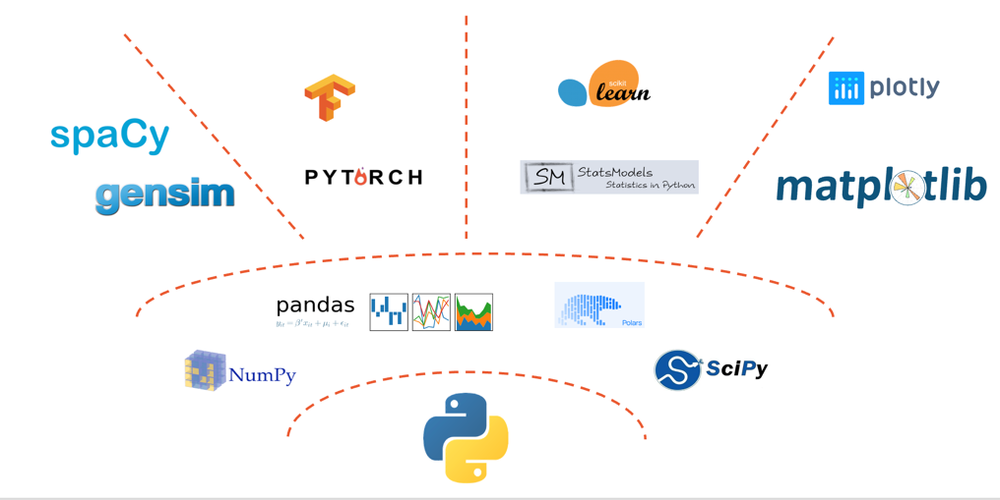
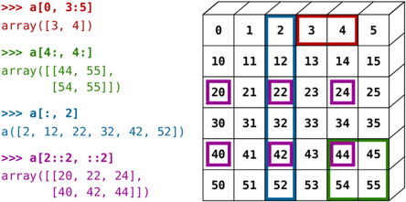
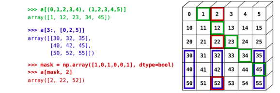

# Python for Data Science

## The Python Data Science Ecosystem

The academic and industrial community has developed a rich ecosystem of libraries and tools for data science, machine
learning, and scientific computing in Python. These libraries provide a wide range of functionalities, from data
manipulation and visualization to statistical modeling and deep learning.
Here are some of the most popular libraries and frameworks in the Python data science ecosystem.

### Natural Language Processing (NLP)

1. **spaCy**: A fast and efficient NLP library for tasks like tokenization, part-of-speech tagging, named entity
   recognition, and dependency parsing.
2. **Gensim**: A library specialized in topic modeling and document similarity analysis using techniques like word
   embeddings (e.g., Word2Vec).

### Machine Learning and Deep Learning

3. **PyTorch**: A powerful deep learning framework providing tools for building and training neural networks, with a
   focus on dynamic computational graphs. Built by Meta.
4. **TensorFlow**: Same as PyTorch, but supported by Google.

### Statistical Modeling

5. **scikit-learn**: A library for general machine learning tasks, including classification, regression, clustering, and
   preprocessing.
6. **Statsmodels**: A library focused on statistical modeling, hypothesis testing, and linear regression analysis.

### Data Visualization

7. **Matplotlib**: A popular library for creating static, animated, and interactive visualizations in Python.
8. **Plotly**: A library for creating interactive visualizations and dashboards with support for web applications.

### Data Manipulation and Computation

9. **pandas**: A library offering data manipulation and analysis tools, particularly for working with structured data
   like tables.
10. **Polars**: A high-performance DataFrame library designed for efficient handling of large datasets, often seen as a
    faster alternative to pandas.

### Scientific Computing

11. **NumPy**: The foundational library for numerical computing in Python, providing support for arrays, matrices, and a
    suite of mathematical operations.
12. **SciPy**: A library building on NumPy, offering more advanced mathematical, scientific, and engineering functions.

At the center is **Python**, serving as the base language connecting all these libraries, showcasing its versatility in
data science, machine learning, and visualization.



## NumPy

NumPy (Numeric Python) is a fundamental library for numerical computing in Python.
It provides support for multidimensional arrays, matrices, and a wide range of mathematical functions to operate on
these arrays.
NumPy is the foundation for many other libraries in the Python data science ecosystem, such as pandas and scikit-learn.

NumPy provides:

- efficient multi-dimensional arrays
- slicing and dicing capabilities
- tools to perform array operations
- linear algebra primitives

### Multidimensional Arrays

NumPy's primary data structure is the `ndarray`, a multidimensional array that can store elements of the same data type.
The `ndarray` is similar to Python's built-in list, but with additional capabilities and optimizations for numerical
computing.
Example:

```python
import numpy as np

array = np.array([[1, 2], [3, 4]])
print(array)
```

Output:

```text
[[1 2]
[3 4]]
```

### Arrays vs Lists

NumPy arrays and Python lists may look similar, but they have different characteristics and use cases.

1. **Type and Purpose**

- **Python Lists**: General-purpose containers for storing collections of objects. They can hold elements of different
  types (e.g., integers, strings, floats, or even other lists). Python lists are versatile and part of Python's standard
  library.
- **NumPy Arrays**: Designed specifically for numerical computation. They are part of the **NumPy library** and can only
  hold elements of a single data type (e.g., integers or floats). They are optimized for **mathematical operations** and
  scientific computations.

2. **Speed and Efficiency**

- **Python Lists**: Not optimized for numerical computations. When performing operations like addition, Python iterates
  through each element manually, making these operations slower. Example: Adding two lists `[1, 2] + [3, 4]` results in
  `[1, 2, 3, 4]` (concatenation, not element-wise addition).
- **NumPy Arrays**: Highly optimized for numerical operations thanks to their underlying **C implementation**.
  Operations are **vectorized**, meaning they process entire arrays at once, which is much faster. Example: Adding two
  arrays `np.array([1, 2]) + np.array([3, 4])` results in `array([4, 6])` (element-wise addition).

3. **Memory Usage**

- **Python Lists**: Store references to the objects they contain, so they consume more memory, especially for large
  datasets.
- **NumPy Arrays**: Store data in contiguous memory blocks, leading to significantly better memory efficiency.

4. **Functionality**

- **Python Lists**: Provide general methods for manipulation, such as appending, slicing, or sorting.
- **NumPy Arrays**: Extend functionality with a wide range of **mathematical operations** (e.g., matrix multiplication,
  element-wise computations, broadcasting, etc.), making them indispensable for data science tasks.

5. **Type Constraints**

- **Python Lists**: Can mix data types (e.g., `[1, "string", 3.5]` is valid).
- **NumPy Arrays**: Enforce a single data type. Mixing types results in implicit conversions to a common type (e.g., an
  array of `[1, "string", 3.5]` becomes an array of strings).

**When to Use Each?**

- Use **Python lists** for general-purpose programming or when handling heterogeneous data.
- Use **NumPy arrays** when working with numerical data or requiring fast, efficient computations (e.g., in data
  science, machine learning, and scientific applications).

### Creating Arrays

#### **From Lists**

The simplest way to create a NumPy array is by converting a Python list or nested list into a NumPy array using the
`np.array` function.

```python
import numpy as np

# 1D array from a list
arr1 = np.array([1, 2, 3])

# 2D array from a nested list
arr2 = np.array([[1, 2, 3], [4, 5, 6]])

# 3D array from a nested list of lists
arr3 = np.array([[[1, 2], [3, 4]], [[5, 6], [7, 8]]])

print("1D Array:\n", arr1)
print("2D Array:\n", arr2)
print("3D Array:\n", arr3)
```

#### **Using Zeros, Ones, and Empty**

NumPy provides utility functions for creating arrays prefilled with specific values:

- **`np.zeros`**: Creates an array filled with zeros.
- **`np.ones`**: Creates an array filled with ones.
- **`np.empty`**: Creates an uninitialized array, where the values are random.

```python
# Array of zeros
zeros_arr = np.zeros((3, 4))  # 3 rows, 4 columns

# Array of ones
ones_arr = np.ones((2, 3))  # 2 rows, 3 columns

# Uninitialized array (values are random, not zero)
empty_arr = np.empty((2, 2))

print("Zeros Array:\n", zeros_arr)
print("Ones Array:\n", ones_arr)
print("Empty Array:\n", empty_arr)
```

#### **Using `arange`**

`np.arange` works similarly to Python's `range`, but returns a NumPy array instead of a list.

```python
# Array of numbers from 0 to 9
arr_range = np.arange(10)

# Array with a step
arr_step = np.arange(0, 10, 2)

print("Range Array:\n", arr_range)
print("Step Array:\n", arr_step)
```

#### **Using `linspace`**

`np.linspace` creates an array of evenly spaced numbers between two values. Unlike `arange`, it specifies the number of
elements instead of the step size.

```python
# 5 numbers between 0 and 1, inclusive
linspace_arr = np.linspace(0, 1, 5)

print("Linspace Array:\n", linspace_arr)
```

#### **Using Identity Matrices**

- **`np.eye`**: Creates a 2D array with ones on the diagonal (identity matrix).
- **`np.identity`**: Similar to `eye`, but only for square matrices.

```python
# Identity matrix
identity = np.eye(3)  # 3x3 identity matrix

print("Identity Matrix:\n", identity)
```

### Array Attributes

NumPy arrays come with a rich set of attributes that provide crucial information about their structure and contents.
These attributes allow you to understand and manipulate arrays effectively. Let’s explore these attributes in detail.

#### **1. `ndim`: Number of Dimensions**

The `ndim` attribute provides the number of dimensions (also called the rank) of the array. For instance:

- A 1D array has `ndim = 1`
- A 2D array has `ndim = 2`
- A 3D array has `ndim = 3`, and so on.

```python
arr1 = np.array([1, 2, 3])  # 1D array
arr2 = np.array([[1, 2, 3], [4, 5, 6]])  # 2D array
arr3 = np.array([[[1], [2]], [[3], [4]]])  # 3D array

print(arr1.ndim)  # Output: 1
print(arr2.ndim)  # Output: 2
print(arr3.ndim)  # Output: 3
```

#### **2. `shape`: Dimensions of the Array**

The `shape` attribute returns a tuple indicating the size of the array in each dimension. It is useful to understand the
layout of your data.

```python
print(arr1.shape)  # Output: (3,) -> 1D array with 3 elements
print(arr2.shape)  # Output: (2, 3) -> 2 rows, 3 columns
print(arr3.shape)  # Output: (2, 2, 1) -> 2 blocks, 2 rows, 1 column
```

The shape can also be reassigned to reshape an array:

```python
reshaped = np.arange(12)
reshaped.shape = (3, 4)
print(reshaped)
# Output:
# [[ 0  1  2  3]
#  [ 4  5  6  7]
#  [ 8  9 10 11]]
```

#### **3. `size`: Total Number of Elements**

The `size` attribute gives the total count of elements in the array, regardless of its dimensions. It is equivalent to
the product of the dimensions.

```python
print(arr1.size)  # Output: 3
print(arr2.size)  # Output: 6 (2 rows × 3 columns)
print(arr3.size)  # Output: 4 (2 × 2 × 1)
```

#### **4. `dtype`: Data Type of Elements**

The `dtype` attribute specifies the type of data stored in the array. NumPy supports various data types, such as
`int32`, `float64`, and `complex128`.

```python
arr_int = np.array([1, 2, 3])
arr_float = np.array([1.1, 2.2, 3.3])
arr_complex = np.array([1 + 2j, 3 + 4j])

print(arr_int.dtype)  # Output: int64 (or platform-specific integer type)
print(arr_float.dtype)  # Output: float64
print(arr_complex.dtype)  # Output: complex128
```

You can specify the data type explicitly when creating an array:

```python
arr = np.array([1, 2, 3], dtype=np.float32)
print(arr.dtype)  # Output: float32
```

#### **5. `itemsize`: Size of Each Element in Bytes**

The `itemsize` attribute indicates the size (in bytes) of each element in the array. This depends on the `dtype`.

```python
print(arr_int.itemsize)  # Output: 8 (on most systems for int64)
print(arr_float.itemsize)  # Output: 8 (for float64)
print(arr_complex.itemsize)  # Output: 16 (for complex128)
```

#### **6. `nbytes`: Total Memory Used**

The `nbytes` attribute calculates the total memory used by the array in bytes. It is equivalent to `size * itemsize`.

```python
print(arr_int.nbytes)  # Output: 24 (3 elements × 8 bytes each)
print(arr_float.nbytes)  # Output: 24
```

#### **7. `T`: Transpose of the Array**

The `T` attribute transposes the array (swaps rows and columns). This is particularly useful for matrices.

```python
matrix = np.array([[1, 2, 3], [4, 5, 6]])
print(matrix.T)
# Output:
# [[1 4]
#  [2 5]
#  [3 6]]
```

#### **Practical Example: Inspecting an Array**

Let’s combine these attributes to inspect an array:

```python
arr = np.arange(12).reshape(3, 4)

print("Array:\n", arr)
print("Dimensions (ndim):", arr.ndim)  # Output: 2
print("Shape:", arr.shape)  # Output: (3, 4)
print("Size:", arr.size)  # Output: 12
print("Data Type (dtype):", arr.dtype)  # Output: int64
print("Item Size (bytes):", arr.itemsize)  # Output: 8
print("Total Memory (nbytes):", arr.nbytes)  # Output: 96
```

### Indexing

NumPy allows you to access elements using indices.
Indexing starts from 0, and arrays can be indexed along each dimension.

### Examples

```python
arr1 = np.array([1, 2, 3])  # 1D array
arr2 = np.array([[1, 2, 3], [4, 5, 6]])  # 2D array
arr3 = np.array([[[1], [2]], [[3], [4]]])  # 3D array

# Accessing elements
print(arr2[0, 1])  # Output: 2 (Row 0, Column 1)
print(arr3[1, 0, 1])  # Output: 6 (Block 1, Row 0, Column 1)
```

Negative indexing is also supported:

```python
print(arr2[-1, -1])  # Output: 6 (Last row, last column)
```

---

### Slicing and Dicing

Slicing allows you to extract subarrays.
The syntax is `start:stop:step`.



Logical indexing is also possible, where you use a boolean array to filter elements.


### Examples

```python
arr2 = np.array([[1, 2, 3], [4, 5, 6]])  # 2D array

# Slicing rows and columns
print(arr2[:, 1])  # Output: [2 5] (All rows, column 1)
print(arr2[0, :])  # Output: [1 2 3] (Row 0, all columns)

# Stepped slicing
print(arr2[:, ::2])  # Output: [[1 3] [4 6]] (Every second column)
```

### Broadcasting

Broadcasting is a powerful feature that allows operations between arrays of different shapes.

#### Rules of Broadcasting

1. If the arrays differ in their number of dimensions, the smaller array is padded with ones on its left side.
2. Arrays with a size of 1 in a dimension are stretched to match the size of the other array.

More details on the [NumPy documentation](https://numpy.org/doc/stable/user/basics.broadcasting.html).

#### Examples

```python
arr4 = np.array([[1, 2, 3], [4, 5, 6]])
arr5 = np.array([1, 2, 3])

# Broadcasting
result = arr4 + arr5  # Add each row of arr4 to arr5
print(result)
# Output:
# [[ 2  4  6]
#  [ 5  7  9]]
```

### Array Operations

#### Elementwise Operations

```python
a = np.array([1, 2, 3])
b = np.array([4, 5, 6])

# Addition
print(a + b)  # Output: [5 7 9]

# Multiplication
print(a * b)  # Output: [4 10 18]

# Exponentiation
print(a ** 2)  # Output: [1 4 9]
```

#### Aggregate Functions

```python
print(np.sum(arr2))  # Sum of all elements: 21
print(np.mean(arr2))  # Mean: 3.5
print(np.max(arr2))  # Maximum value: 6
```

### Linear Algebra

NumPy includes functions for performing common linear algebra operations, such as dot products, matrix multiplications,
and decompositions.

#### Examples

```python
A = np.array([[1, 2], [3, 4]])
B = np.array([[5, 6], [7, 8]])

# Matrix multiplication
C = np.dot(A, B)
print(C)
# Output:
# [[19 22]
#  [43 50]]

# Transpose
print(A.T)
# Output:
# [[1 3]
#  [2 4]]
```

NumPy also supports:

- **Eigenvalues and eigenvectors**: `np.linalg.eig`
- **Inverse of a matrix**: `np.linalg.inv`

### Random Numbers
Generating random numbers is a challenging problem in computer science because computers are inherently deterministic systems. 
They operate by following precise rules and instructions, which makes it difficult to produce outcomes that are genuinely unpredictable. 

Randomness, by its nature, lacks order or predictability, while a computer’s processes are entirely governed by logic and algorithms. 
Traditional methods for generating random numbers, known as pseudo-random number generators (PRNGs), rely on mathematical formulas or predefined rules to create sequences of numbers that mimic randomness. 
However, these sequences are not truly random; they are determined by an initial value called a "seed." 
If the seed is known, the entire sequence can be reproduced, highlighting the deterministic foundation of the process. 

This reliance on algorithms to simulate randomness reveals the underlying difficulty: achieving numbers that appear random while being produced by a predictable system. 
True randomness, in contrast, often depends on unpredictable physical phenomena, like atmospheric noise or radioactive decay, which are outside the realm of standard computational processes. 

### Random Numbers in Numpy

NumPy’s random number generation has been updated in version 1.17.0 to introduce the `numpy.random.Generator` framework,
which provides more control, better performance, and reproducibility compared to the older random number APIs.

The modern way to generate random numbers is by using the `numpy.random.default_rng()` method to create a random number
generator instance. This approach ensures consistent and thread-safe results.

#### **Creating a Random Generator**

The `default_rng()` function initializes a new generator:

```python
import numpy as np

# Create a random number generator
rng = np.random.default_rng(seed=42)
```

#### Random Number Generation

#### Uniform Distribution

Generates random numbers between 0 and 1, uniformly distributed:

```python
# Generate an array of 3 random numbers
uniform_random = rng.random(3)

print("Uniform Random Numbers:\n", uniform_random)
```

#### Random Integers

Generates random integers within a specified range:

```python
# Generate a 2x3 array of random integers between 0 and 9
rand_integers = rng.integers(0, 10, size=(2, 3))

print("Random Integers:\n", rand_integers)
```

#### Normal Distribution

Generates numbers following a Gaussian distribution with specified mean and standard deviation:

```python
# Generate a 3x3 array of normally distributed random numbers
rand_normal = rng.normal(loc=0, scale=1, size=(3, 3))

print("Random Numbers (Normal Distribution):\n", rand_normal)
```

#### Random Choices

Selects random samples from a specified array:

```python
# Randomly select 5 elements from a given array
rand_choices = rng.choice([10, 20, 30, 40, 50], size=5, replace=True)

print("Random Choices:\n", rand_choices)
```

## Polars
Polars is a high-performance DataFrame library for Python and Rust, designed to handle large datasets efficiently. It offers a fast, multi-threaded engine that outperforms traditional libraries like pandas in both speed and memory usage. Polars achieves this by utilizing Apache Arrow's columnar memory format, enabling efficient data processing and interoperability with other data tools.

Key features of Polars include:

- **Lazy Evaluation**: Polars delays computation until necessary, optimizing query execution and reducing redundant calculations.

- **Multi-threaded Execution**: It leverages multiple CPU cores to parallelize operations, significantly speeding up data processing tasks.

- **Expressive Query Language**: Polars provides a user-friendly API for complex data manipulations, including filtering, aggregations, and joins.

- **Interoperability**: Its compatibility with Apache Arrow facilitates seamless data exchange with other data processing systems.

For professionals with a computer science background, Polars offers a robust alternative to pandas, especially when working with large datasets or requiring high-performance data processing. Its design principles align with modern data engineering practices, making it a valuable tool in the data science ecosystem.

### Polars Tutorial
Go to the notebook folder and run
```bash
jupyter lab
```
Then, open the `Polars Tutorial.ipynb` notebook to learn more about Polars and its functionalities.