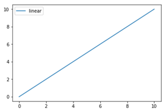
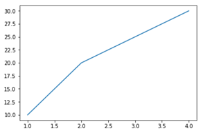
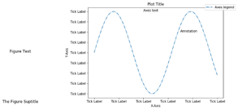
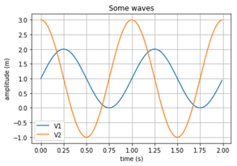
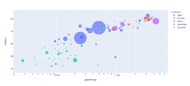

# Code for Humans

## A Hard Task

Data Visualization may look like a simple task, but it is not. It requires a lot of effort to make a good visualization.
Don't believe me? Here are some examples of bad visualizations:

- [Sarah Leo, Mistakes, We've Drawn a Few](https://medium.economist.com/mistakes-weve-drawn-a-few-8cdd8a42d368)
- [Emanuele Fabbiani, The Traps of Data Visualization](https://towardsdatascience.com/lessons-from-a-real-machine-learning-project-part-2-the-traps-of-data-exploration-e0061ace84aa)

## The Role of Data Visualization in Data Science

Data visualization is a cornerstone of Data Science, translating abstract data into visual formats that reveal patterns,
trends, and anomalies. It allows us to communicate complex findings to diverse audiences, whether they are technical
stakeholders or decision-makers with no technical background. However, visualization is more than just "making data look
pretty"; it is a narrative tool.

Every chart tells a story, and your role as a data scientist is to ensure the story is clear, accurate, and impactful.

## Data Visualization as Mapping

There is a scientific background to data visualization. Data visualization is about associating quantities to physical
attributes of an object (e.g., color, length, …). It is a complex topic we will largely overlook.
Here is a great class: [J. C. Hart, Data Visualization](https://www.coursera.org/learn/datavisualization).

## Data Visualization as Storytelling

Visualization without context is like a story without a plot. Charts should guide the viewer through the narrative,
focusing their attention on the most critical insights. Poor visualizations, on the other hand, confuse, mislead, or
hide the truth.

### Common Visualization Pitfalls

1. **Cherry-Picking Data**: Omitting critical context or selectively presenting data can distort the truth.
2. **Inappropriate Chart Types**: Using a pie chart for precise comparisons or a line chart for categorical data can
   mislead viewers.
3. **Overloading with Details**: Adding excessive elements—unnecessary grid lines, too many colors, or redundant
   annotations—creates visual clutter.
4. **Poor Scaling**: Manipulating axes or scales can exaggerate or minimize trends, eroding trust.

### Visualizations Done Right

1. **Focus on Clarity**: Simplicity is powerful. A clean, well-labeled chart can reveal more than a cluttered, overly
   complex one.
2. **Choose the Right Chart Type**: Understand the data relationships you want to showcase:
    - **Line charts**: Trends over time.
    - **Bar charts**: Comparisons among categories.
    - **Scatter plots**: Relationships between variables.
    - **Heatmaps**: Patterns in dense data.
3. **Keep the Audience in Mind**: Adjust complexity, labels, and annotations based on the viewer's expertise.

### Improving Your Charts: Practical Tips

1. **Label Thoughtfully**
    - Use concise, descriptive titles that summarize the main insight (e.g., "Sales Growth in Q1 2023").
    - Clearly label axes with units (e.g., "Time (days)", "Revenue (in thousands)").
    - Avoid jargon if presenting to non-technical audiences.

2. **Guide the Viewer**
    - Use color to highlight key data points while maintaining accessibility (e.g., avoid relying solely on red/green
      for colorblind audiences).
    - Add annotations to emphasize important features or outliers.

3. **Use Grids and Legends Sparingly**
    - Include grid lines for guidance but avoid overloading the chart.
    - Place legends where they don't obscure the chart, or integrate them into the title when possible.

4. **Leverage Interactivity**
    - Tools like Plotly and Tableau allow users to explore data dynamically. Interactive charts can provide multiple
      layers of information without overwhelming the initial view.

5. **Test and Iterate**
    - Share drafts of visualizations with colleagues or stakeholders for feedback. Ensure they understand the story your
      chart is trying to tell.

### The Human Element: Understanding Cognitive Load

When designing visualizations, consider the cognitive load on your audience. Too much information overwhelms viewers,
while too little leaves them confused. Strike a balance:

- Use color and layout to create visual hierarchies.
- Group related elements together.
- Minimize distractions by removing unnecessary elements.

### A Checklist for Effective Data Visualization

1. **Does the visualization match the story you want to tell?**
2. **Is the chart type appropriate for the data?**
3. **Are labels, titles, and annotations clear and descriptive?**
4. **Is the design free of unnecessary clutter?**
5. **Have you tested the visualization with your target audience?**

## Matplotlib

Matplotlib is a Python plotting library which produces publication quality figures in a variety of hardcopy formats and
interactive environments across platforms.

Matplotlib can be used in Python scripts, the Python and IPython shells, the Jupyter notebook, web application servers,
and graphical user interface toolkits.

The most basic usage of Matplotlib consists in just creating a plot and showing it. Matplotlib uses NumPy arrays for
chart data.

```python
import matplotlib.pyplot as plt
import numpy as np

x = np.linspace(0, 10, 100)

plt.plot(x, x, label='linear')
plt.legend()
plt.show()
```



All the elements of a plot are encapsulated by the Figure and Axes objects.

If subplots or multiple axes are not needed, do not use Axes.

Prefer:

```python
plt.plot([1, 2, 3, 4], [10, 20, 25, 30])
plt.show()
```

Over:

```python
fig = plt.figure()
ax = fig.add_subplot(111)
ax.plot([1, 2, 3, 4], [10, 20, 25, 30])
plt.show()
```



Plots are made of composable elements:

- Title
- X axis
- Y axis
- Legend
- Annotations
- Plot series



Such elements can be composed in a plot to create a visualization.

```python
import matplotlib.pyplot as plt
import numpy as np

t = np.arange(0.0, 2.0, 0.01)
v1 = 1 + np.sin(2 * np.pi * t)
v2 = 1 + 2 * np.cos(2 * np.pi * t)

plt.plot(t, v1, label='V1')
plt.plot(t, v2, label='V2')
plt.xlabel('time (s)')
plt.ylabel('amplitude (m)')
plt.title('Some waves')
plt.legend()
plt.grid()
plt.show()
```



Moreover, matplotlib provides useful functions to save plots in different formats:

```python
import matplotlib.pyplot as plt
import numpy as np

x = np.linspace(0, 10, 100)

plt.plot(x, x, label='linear')
plt.legend()
plt.savefig('chart.png')
```

Remember to save your plots before calling the `show()` function, as it clears the current figure.

## Seaborn

Seaborn offers several advantages for data visualization:

1. **High-Level Interface**: Seaborn abstracts much of the complexity of Matplotlib, making it easier to create complex
   visualizations with minimal code.
2. **Beautiful Default Styles**: Seaborn's default settings produce aesthetically pleasing plots that are
   publication-ready.
3. **Integration with Pandas**: Seaborn works seamlessly with Pandas DataFrames, making it easy to plot directly from
   tabular data.
4. **Built-in Statistical Functions**: Many statistical visualizations (like regression plots and distribution plots)
   are built into Seaborn, saving you time.

Seaborn is built on top of Matplotlib, so you can use both libraries together. Seaborn is particularly useful for
creating complex visualizations with minimal code.

### Example Dataset

Seaborn comes with several built-in datasets to practice visualization. For this chapter, we'll use the `tips` dataset:

```python
import seaborn as sns

# Load the built-in 'tips' dataset
tips = sns.load_dataset("tips")
tips.head()
```

### Scatter Plot

A scatter plot visualizes the relationship between two numerical variables.

```python
sns.scatterplot(data=tips, x="total_bill", y="tip", hue="sex", style="time", size="size")
plt.title("Scatter Plot of Tips vs. Total Bill")
plt.show()
```

- `hue`: Color-code points by a categorical variable.
- `style`: Vary the marker style by a categorical variable.
- `size`: Adjust marker size by a numerical variable.

---

### Line Plot

Use a line plot for time series or trend data.

```python
sns.lineplot(data=tips, x="size", y="total_bill", hue="time")
plt.title("Line Plot of Total Bill by Party Size")
plt.show()
```

---

### Bar Plot

Bar plots display the distribution of a categorical variable.

```python
sns.barplot(data=tips, x="day", y="total_bill", hue="sex", ci="sd")
plt.title("Bar Plot of Total Bill by Day and Gender")
plt.show()
```

- `ci`: Confidence interval to plot around the mean (`ci="sd"` uses the standard deviation).

### Histogram

A histogram shows the frequency distribution of a numerical variable.

```python
sns.histplot(data=tips, x="total_bill", bins=20, kde=True, hue="sex")
plt.title("Histogram of Total Bill with KDE")
plt.show()
```

- `bins`: Number of bins to divide the data.
- `kde`: Overlay a Kernel Density Estimate (KDE) curve.

---

### Box Plot

Box plots summarize data using quartiles and highlight potential outliers.

```python
sns.boxplot(data=tips, x="day", y="total_bill", hue="sex")
plt.title("Box Plot of Total Bill by Day and Gender")
plt.show()
```

---

### Violin Plot

Violin plots combine KDE and box plots to show distributions and medians.

```python
sns.violinplot(data=tips, x="day", y="total_bill", hue="sex", split=True)
plt.title("Violin Plot of Total Bill by Day and Gender")
plt.show()
```

- `split`: Split the violins for easier comparison across categories.

### Pairplot

Pairplots visualize relationships across all numerical variables in a dataset.

```python
sns.pairplot(data=tips, hue="sex")
plt.show()
```

### Heatmap

A heatmap visualizes correlations or matrices.

```python
corr = tips.corr()
sns.heatmap(corr, annot=True, cmap="coolwarm", fmt=".2f")
plt.title("Correlation Heatmap")
plt.show()
```

### Customizing Plots

Seaborn allows for extensive customization:

- **Style**: Set global themes.
    ```python
    sns.set_theme(style="whitegrid")
    ```

- **Titles and Labels**: Use Matplotlib functions.
    ```python
    plt.title("Custom Title")
    plt.xlabel("X-axis Label")
    plt.ylabel("Y-axis Label")
    ```

- **Saving Plots**: Save as an image file.
    ```python
    plt.savefig("plot.png", dpi=300, bbox_inches="tight")
    ```

## Plotly

Plotly is a cross-platform charting library to create high-quality interactive charts.
Main features:

- Rich chart library
- Interactive, HTML-based charts
- Serializable plots
- Dump to png and jpeg

Since the release of version 4.0, in 2019, Plotly enjoys a new high-level module, Plotly Express.

It has made considerably easier to create even complex charts with interactive capabilities.

```python
import numpy as np
import plotly.express as px

t = np.linspace(0, 10, 1000)
s = 1 + np.sin(2 * np.pi * t)
px.line(x=t, y=s, title='A simple chart')
```

Plotly Express can work with simple numpy vectors, but it becomes very powerful when used with Pandas or Polars data
frames.

Taking inspiration from ggplot2, Plotly Express uses aesthetics.

```python
import plotly.express as px

df = px.data.gapminder()
fig = px.scatter(
    df.query("year==2007"),
    x="gdpPercap",
    y="lifeExp",
    size="pop",
    color="continent",
    hover_name="country",
    log_x=True,
    size_max=60)
fig.show()
```



Plotly is highly customizable.
The functions in plotly express return objects which can be modified before being plotted.

Moreover, predefined templates can be used.

```python
import plotly.express as px
import plotly.io as pio

pio.templates.default = "plotly_white"

df = px.data.gapminder()
fig = px.scatter(
    df.query("year==2007"),
    x="gdpPercap",
    y="lifeExp",
    size="pop",
    color="continent",
    hover_name="country",
    log_x=True,
    size_max=60)
fig.show()
```

Learn more about Plotly Templates [here](https://plotly.com/python/templates/).

## Streamlit

Streamlit is a powerful, open-source Python library that simplifies the process of creating interactive web apps for
data visualization and analysis.

It is particularly useful for data scientists who want to quickly share insights and results without diving into
full-stack web development.

In this section, we will build a simple data dashboard using Streamlit. By the end, you will understand how to:

1. Install and set up Streamlit.
2. Create a basic Streamlit app.
3. Add interactivity with widgets.
4. Visualize data dynamically.

---

### Creating a Basic Streamlit App

Create a new Python file named `dashboard.py` and add the following code:

```python
import streamlit as st

# Title
st.title("My First Streamlit Dashboard")

# Description
st.write("This is a simple dashboard to visualize data dynamically.")
```

To run the app, execute the following command in your terminal:

```bash
streamlit run dashboard.py
```

This will open a new tab in your browser displaying the app.

### Adding Interactivity

Streamlit provides various widgets like sliders, dropdowns, and buttons to make your app interactive. Let’s add a slider
and a button to our app:

```python
# Import necessary libraries
import streamlit as st
import pandas as pd
import numpy as np

# Title and description
st.title("Interactive Dashboard")
st.write("Use the slider below to filter the data.")

# Slider for user input
rows = st.slider("Select number of rows", min_value=10, max_value=100, value=50, step=10)

# Generate sample data
data = pd.DataFrame({
    'Column A': np.random.randint(1, 100, rows),
    'Column B': np.random.randint(1, 100, rows)
})

# Display data
st.write("Here is the generated data:")
st.write(data)
```

### Visualizing Data

Streamlit supports popular data visualization libraries like Matplotlib, Seaborn, and Plotly. Let’s visualize the data
dynamically using Streamlit’s built-in chart functions:

```python
# Visualization: Line chart
st.write("Line Chart of the Data:")
st.line_chart(data)

# Visualization: Bar chart
st.write("Bar Chart of Column A:")
st.bar_chart(data['Column A'])
```

### 5. **Complete Example**

Here’s the full code for a basic interactive dashboard:

```python
import streamlit as st
import pandas as pd
import numpy as np

# Title and description
st.title("Streamlit Dashboard")
st.write("This is an interactive dashboard built with Streamlit.")

# Add interactivity: Slider
rows = st.slider("Select number of rows", min_value=10, max_value=100, value=50, step=10)

# Generate random data
data = pd.DataFrame({
    'Column A': np.random.randint(1, 100, rows),
    'Column B': np.random.randint(1, 100, rows)
})

# Display data
st.write("Generated Data:")
st.write(data)

# Add visualizations
st.write("Line Chart:")
st.line_chart(data)

st.write("Bar Chart (Column A):")
st.bar_chart(data['Column A'])
```

Save this as `dashboard.py` and run it with:

```bash
streamlit run dashboard.py
```

### Conclusion
Now we have all the elements to face the final 